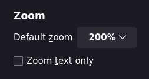
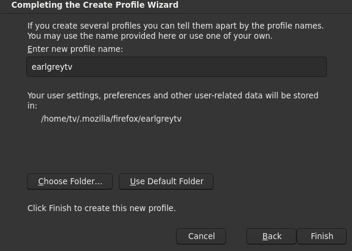
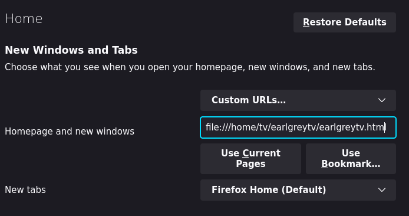
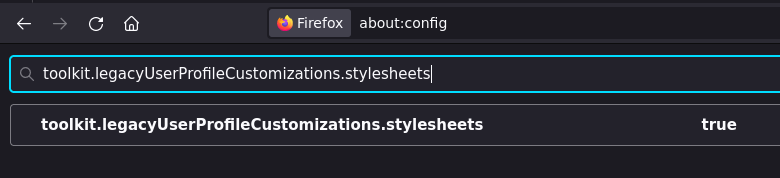
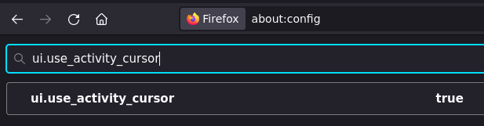

# EarlgreyTV

This is ...

[picture]

Warning: This is mostly a collection of my notes. I haven't tested if these steps work perfectly on a fresh install. Be able to debug things yourself if anything goes wrong.

I encourage you to customize this as much as possible. Please make it *your* perfect setup, not mine.

# Configuring and running locally


# Hardware setup notes

## TV

Get yourself something you can use as a screen for your setup. Ideally, it should be as dumb as possible - simply showing the ouput of the computer you plug into it.

I couldn't find a dumb TV, so I got a smart TV, and used settings to dumb it down a bit.

I got `SAMSUNG 55" 4K UHD LED TV TU55CU7105KXXC` (3840x2160), and connect it with HDMI.

I did this setting change:

- \> All Settings
- \> General & Privacy
- \> Start Screen Options
- "Autorun Last App"

My HDMI connection is considered an "App".

Side note: Some TVs have hidden menus which can allow you to dumb them down even more, [example](https://youtu.be/LGngUs30dh0). The regular settings seemed to work okay for me though.

## Computer

You need a computer to power your setup. An old used laptop is perfect.

I used a 5 year old Lenovo laptop with a broken keyboard (becaue I spilt earlgrey tea into it).

## Remote

Since this setup is a regular desktop setup disgused as a smart TV, you need something to be your mouse. You need a keyboard too (although maybe you can trigger an on-screen keyboard).

I chose `WECHIP W3 2.4G 3-i-1 2.4G Air Mouse`. It uses a small gyroscope as input for the mouse, and has a small keyboard on the back. It's good but a bit flimsy.


## Optional extras

### HDMI USB CEC adaptor

I use [CEC](https://en.wikipedia.org/wiki/Consumer_Electronics_Control) to allow my computer to suspend my TV. I need an adaptor, because the laptop doesn't support the CEC protocol itself.

I use the `Pulse Eight USB-CEC Adapter`.

### USB extender

For your mouse, you'll likely get a very small USB receiver, [example](https://upload.wikimedia.org/wikipedia/commons/7/7d/Logitech_unifying_receiver.jpg). Depending where you place your laptop, you might need to extend the receiver.

I use a generic USB extender, [example](https://commons.wikimedia.org/wiki/File:USB_extender_cable.jpg).

# Software setup notes

## Operating system

I went with [Debian Linux](https://www.debian.org/). I named my user `tv`.

## Desktop environment

I chose [Sway](https://swaywm.org/). I needed something I could easily configure with a config file, and would be highly minimal.

In retrospect, maybe regular [i3](https://i3wm.org/) would have been better. The automation tools that exist for the (X Window System)[https://en.wikipedia.org/wiki/X_Window_System] are more documented.

Run:

```sh
sudo apt install sway -y
```

Then log out of GNOME, and log into Sway.

## Packages

These are the packages I could gather from my notes. There may be a couple I forgot, and some not needed.

```Sh
sudo apt install rsync pulseaudio pulseaudio-utils playerctl pamixer xdotool ydotool input-util xbindkeys wtype udev cec-utils -y
```

## SSH notes

The next steps depend on an SSH connection to your TV. I recommend adding your TV computer to you `~/.ssh/config`. This is how I connect to my TV:

```sh
ssh tv
```

**Tip: preforming Sway commands over SSH:**

Interacting with Sway over SSH might give you an error like this: `swaymsg/main.c:419] Unable to retrieve socket path`

This is my fix:

```sh
export SWAYSOCK=$(find /run/user/1000/ -name "sway-ipc.1000*.sock" -print -quit)
# Now you should be able to e.g. reload Sway:
swaymsg reload
```

## Firefox manual settings

### Set zoom

You likely need some extra zoom on the website you visit. How much depends on how big your screen is. 200% looks good on my TV.

Navigate to `about:preferences`.

Set "Default zoom" to 200%.



### Create profile

The profile is used for a predictable path to place a config file.

Navigate to `about:profiles`.

Make sure to click "Choose Folder..." and set it to `/home/tv/.mozilla/firefox/earlgreytv`



"Default Profile" should be set to "yes"

### Set homepage

Navigate to `about:preferences#home`.

For the homepage, pick "Custom URLS...". Then set it to `file:///home/tv/earlgreytv/earlgreytv.html`.



### Enable stylesheets

Navigate to `about:config`, and set `toolkit.legacyUserProfileCustomizations.stylesheets` to `true`.



### Enable activity cursor

This will indicate on the cursor if the page is loading.

Navigate to `about:config`, and set `ui.use_activity_cursor` to `true`.




## Sync configs

Run `./sync.sh` in this directory, to sync files needed for the EarlgreyTV setup.

```sh
# Make sure you have rsync
sudo apt install rsync -y
# Sync files 
./sync.sh
```

## Apply configs

Run `./apply.sh` to restart any services that uses config files. Doesn't restart Firefox.

```sh
./apply.sh
```

# Thank you to